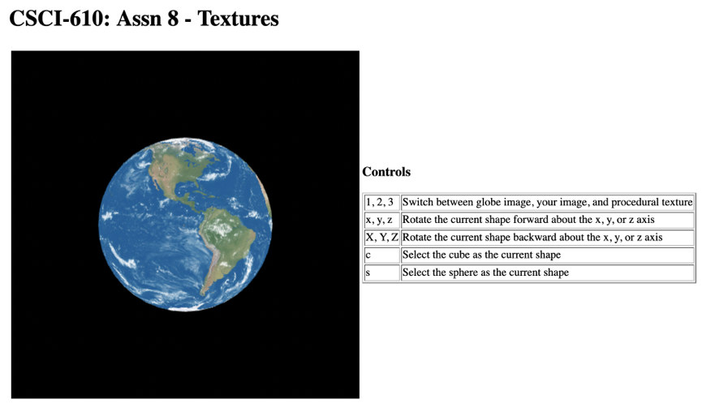

# Computer-Graphics-Textures
CSCI-610

# Introduction

The goal of this assignment is to familiarize yourself with the method of loading and applying textures in OpenGL The assignment will require you to complete an application that applies 3 different textures (2 image textures, 1 procedural texture) to a sphere and a cube.
Upon opening the page without edits, you should see something that looks like this:

# What you need to do

* The file in the package sets up the application of the globe texture. You will need to add to additional textures to be utilized:
* An image texture -- of your choice
* A procedural texture -- of your choice.
* Adding these texture will require modification of both the javascript host code as well as the GLSL shaders in assn8-textures. html.
* There are several ways that you can approach this: The first is to create new fragment shaders for the additional textures to be shown or the better approach would be to use the current fragment shader and add a new uniform variable that indicates with texture should be applied.

Modifications to the host avascript code include: In the file textureMain.js:-
* Changes need to be made to the function setUpTextures () to include your new image texture... Note that the function is already set up to load the globe texture.
* In the function drawCurrent Shape () , you'll need to send values for whatever new uniforms that you define in your fragment shaders.
* In the function initProgram (), you will need to add references to new uniform variables that you define in your fragment shaders.
